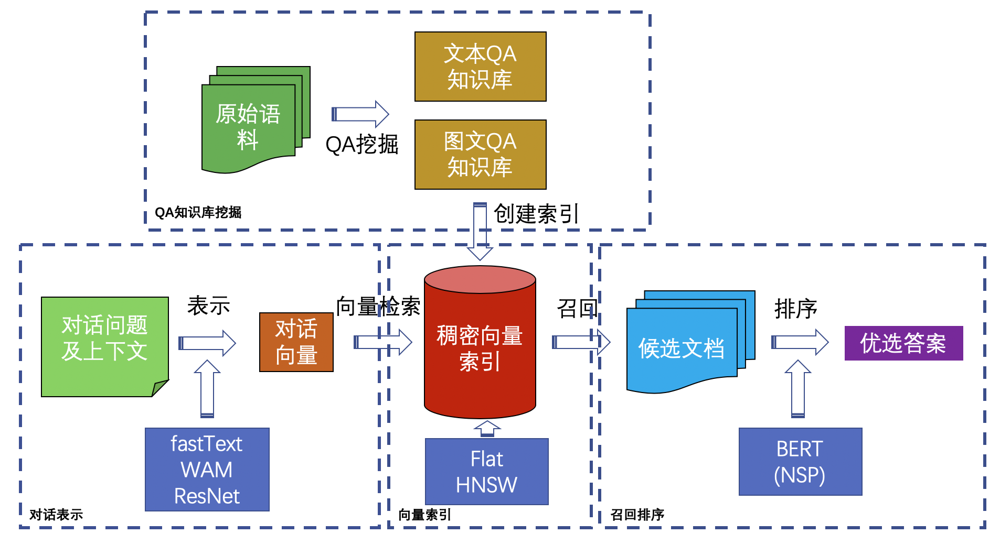

## 2020智源-京东多模态对话挑战大赛基线模型MDDR
本代码提供了2020智源-京东多模态对话挑战大赛的一种基线模型实现，提供了对大赛原始数据清洗、模型训练以及在线评测提交的实现。

### 模型简介
Multimodal Dialogue Dense Retriever模型（MDDR），能够实现文本或图片两种模态多轮对话的检索，通过对海量多模态历史交互信息的检索召回与排序，实现对当前问题的应答。模型结构见下图。

Overview of Multimodal Dialogue Dense Retriever

### 模型子模块
#### 闲聊分类模块
针对多轮对话场景，判断当前用户问题是否含有充足的业务信息。在对话过程中，系统会使用该模块对用户问题进行判断，如果当前信息不足以进行有意义的应答，则系统会加上上一轮的用户问题，进行检索召回。

该模块示例使用fasttext模型实现，并随机挑选了2200条此次比赛训练集中出现的数据进行标注，其中标签"1"表示该问题是缺乏业务知识的闲聊，标签"0"表示该问题还有业务知识。

在./chat文件夹下，直接运行，即可得到闲聊分类模型：

    python3 chat_classifier_train.py
    
#### 问答挖掘模块
该模块处理大赛发布的文本训练集数据，按照原始数据中的自然顺序将用户的消息当做问题，将客服的消息当做当前问题的应答，并根据人为制定的规则和闲聊分类模型的结果，将含有充足业务信息的问题和应答作为文档知识库保存下来。
该模型从./data文件夹下读取此次比赛的训练集数据，并以此构建QA文本知识库，（注：当前示例业务逻辑依赖于闲聊分类模型，请先训练闲聊模型）：

	python3 qa_mining.py

#### 问答索引模块
该模块将句子或图片转换成为稠密向量后，再建立相关索引，可以通过向量之间的的相似性，得到请求向量的相似向量，并可以得到索引前的原始对象。

对于文本问答对知识库，会通过句子中每个词向量的平均值作为句子稠密向量的表达，所以在程序运行前需要指定词向量的文件输入。本示例将文本问答知识库中的Q建立了索引，在后面的处理中通过Q-Q的匹配进行候选应答的召回：

	python3 qa_text_index.py
	
对于图片问答对知识库，会通过预训练Resent18模型提取问题图片特征，需要从Pytorch官网下载预训练esent18模型[https://download.pytorch.org/models/resnet18-5c106cde.pth](https://download.pytorch.org/models/resnet18-5c106cde.pth)，并在程序运行前需要export相关路径。本示例将图片问答知识库中的图片问题提取特征建立了索引，在后面的处理中通过问图片问题的相似性进行候选应答的召回：

    python3 qa_image_index.py

#### 应答文本分类模块
该模型以预训练的bert-base-chinese为基础，在大赛数据上自动构建Q-A对训练数据，使用bert中Next Sentence Prediction (NSP)的任务对模型进行fine-tune。该模型便可以对检索模型的召回结果进行排序， 从而得到最终的用户问题应答。
该模块以问答挖掘模块产生的文档知识库为数据资源，其中以知识库中存在的QA对，Qn与An问答对作为正例，以Qn与Arandom问答对作为负例，构建用于该模型训练的数据，在./transformers文件夹下，运行：

	python3 preprocess.py
	
接下来，在生成了模型所需的训练数据后，即可进行该模型的训练： (注：在运行前需要下载bert-base-chinese的配置文件、词表和预训练文件)
    
    ./run.sh
    
#### 召回与排序模块
在本示例中，召回与应答模块直接读取线上评测目录中评测问题./online_test_data/test_questions.json文件，最终生成用于评测的应答文件/online_test_data/test_answers.json文件。
召回模块读取用户问题，并用闲聊模型进行判断，如果认为当前信息不充足，则会使用上轮用户问题进行检索。用户请求的句子会转换成平均词向量检索先前建立好的知识库，找出相似的候选QA对，并保存至临时文件test_text_recall.json；用户图片类问题请求通过预训练Resnet18提取特征后，检索图文问答知识库找出候选回答，并保存至临时文件test_safe_answer.json：
    
    python3 mddr_recall.py
    
排序模块，会读取临时文件存储的召回结果，并通过应答文本分类模型判断召回的结果是否与用户问题相匹配，从而找到最优的文本召回答案，并结合先前图文检索的答案，得到最终答案并转换成线上评测所需要的文本格式。

首先将召回的结果传给应答文本分类模块，对召回的结果做出评估，所以需要将召回结果放置到应答文本分类模型文件夹下任务数据存储的地方，但由于由代码会缓存测试集，所以还需要保证cache的测试数据已经被删除：

    cp test_text_recall.json transformers/data/jddc/test.json
    rm transformers/data/jddc/cached_test_bert-base-chinese_128_jddc
    cd transformers
    ./run.sh predict
最终，排序模块会综合分类模型对文本召回候选的判断的结果test_prediction.json和图片召回的候选结果test_safe_answer.json等临时文件，最终产生最后用于评测的文件：

    python3 mddr_rank.py
    
### 参考与致谢

本示例在实现过程中参考了以下资料，在此表示感谢：
1. [https://zhuanlan.zhihu.com/p/136971135](https://zhuanlan.zhihu.com/p/136971135)
2. [https://github.com/CLUEbenchmark/CLUE](https://github.com/CLUEbenchmark/CLUE)
3. [https://github.com/facebookresearch/faiss](https://github.com/facebookresearch/faiss)