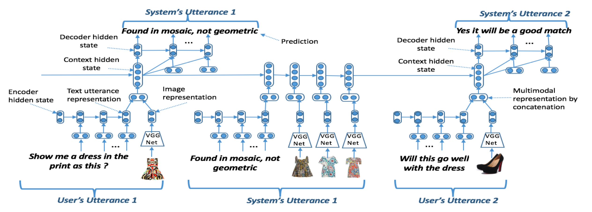

## 2020智源-京东多模态对话挑战大赛基线模型MHRED （PyTorch实现）

本代码提供了2020智源-京东多模态对话挑战大赛的一种基线模型实现，提供了对大赛原始数据清洗、模型训练以及在线评测提交的实现。

### 模型简介
Multimodal Hierarchical Encoder Decoder模型（MHRED），能够实现多模态多轮对话的建模，端到端生成文本应答，实现多轮对话。模型结构见下图，具体可参考论文：[https://arxiv.org/abs/1704.00200v3](https://arxiv.org/abs/1704.00200v3)。

Overview of Multimodal Hierarchical Encoder Decoder

此外，该代码实现基于开源项目[https://github.com/lipiji/dialogue-hred-vhred](https://github.com/lipiji/dialogue-hred-vhred)，在此表示感谢。

### 模型训练

#### 大赛数据预处理
读取./data文件夹下大赛官方提供的文本与图片数据，进行分词并进行简单预处理，按照"源文本数据<\t>目标文本数据<\t>多媒体图片列表"的格式产生用于序列到序列的对话生成数据：

    python3 raw_data_preprocess.py
产生训练数据如下，其中\</s\>用于分割不同的消息，\用于原始文本中图片文件名的替换， NULL表示该消息非图片消息：

    你好</s></s></s>在 的</s>这么晚 打扰 ， 不好意思</s>您好 有 什么 需要 帮 您 的</s>没关系 的</s>看 我 发 的 图	好 的 有 什么 可以 帮 您 的 吗	NULL 8da95ffeda173c10b90752284aaed5a7.jpg 7fc6cac592fa81f13a97e10cd9154dfc.jpg NULL NULL NULL NULL NULL
    这么晚 打扰 ， 不好意思</s>您好 有 什么 需要 帮 您 的</s>没关系 的</s>看 我 发 的 图</s>好 的</s>有 什么 可以 帮 您 的 吗</s>为啥 快递 信息 还是 寄 的 xs 码 ？	您 申请 的 是 多少 码 的	NULL NULL NULL NULL NULL NULL NULL
    看 我 发 的 图</s>好 的</s>有 什么 可以 帮 您 的 吗</s>为啥 快递 信息 还是 寄 的 xs 码 ？</s>您 申请 的 是 多少 码 的</s>s	稍等一下	NULL NULL NULL NULL NULL NULL

#### 模型数据预处理
进一步处理生成的对话数据，将数据转换成适应于本模型结构并能够被PyTorch DataLoader所加载的内部数据结构：  

    python3 prepare_data.py

#### 下载预训练模型  
由于该实现模型中使用了预训练resnet18模型对图像数据做嵌入，所以需要从PyTorch官网下载预训练resent18模型[https://download.pytorch.org/models/resnet18-5c106cde.pth](https://download.pytorch.org/models/resnet18-5c106cde.pth)。在程序运行前需要export相关路径，如：

    export TORCH_HOME=~/notespace/.torch

#### 训练模型  
  运行train.py训练模型:

    train.py --model=MHRED

### 在线模型评估  

按照大赛线上评测方法说明，比赛系统需要提供名称为online_test.sh脚本文件，完成线上模型效果评测。这里给出系统需要提交的线上评测脚本的样例实现。

#### 在线评估脚本样例  

模型在代码根目录需要提交的online_test.sh脚本，需要完成线上评测数据读取，模型问题预测，线上评测预测数据输出共三个步骤：  

  转换测试问题数据的格式，转换在线测试数据(./online_test_data/test_question.json)为内部模型数据格式：  

    python3 online_test_data_preprocess.py
  
  推断测试问题，给出模型的预测答案：  

    python3 online_test_inference.py --checkpoint=/xxx/mhred/chk/1.pkl

  转换模型的预测答案，输出成在线测试要求格式(./online_test_data/test_answers.json)  

    python3 online_test_data_postprocess.py
  

